# Docker Kurulum talimatları

## Docker 🐋

Docker, uygulama geliştirme, paketleme ve çalıştırma için açık bir platformdur.

_Eğer bilgisayarınızda zaten Docker yüklüyse, lütfen en son sürüme güncelleyin._

### Docker'ı Yükleme

[Docker](https://docs.docker.com/get-docker/)  web sitesine gidin ve işletim sisteminizi seçin:


Ardından kurulum talimatlarını takip edin ve masaüstü uygulamasını kurun.

Intel veya AMD işlemciniz varsa, "x86_64" ile biten ilk seçeneği tercih edebilirsin.

<details>
  <summary markdown='span'>Hangi işlemciye sahip olduğundan emin değil misin?</summary>

  Çoğunlukla Intel veya AMD işlemciniz varsa `x86_64` sürümüne ihtiyacınız olacaktır.

  Makinenizin hangi işlemciye sahip olduğunu bilmiyorsanız, Ubuntu terminalinde `arch` komutunu çalıştırın. Çıktısını kontrol edin:
  - `x86_64` => ilk "x86_64" seçeneğini seçin
  - `aarch64`=> ikinci "Arm" seçeneğini seçin

</details>

Kurulum tamamlanıp başlatıldıktan sonra Docker'ın çalıştığını doğrulayın:

```bash
docker run hello-world
```

Şuna benzer bir çıktı almalısın:

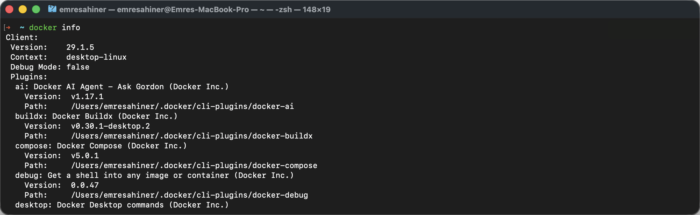

<details>
  <summary markdown='span'>Permission denied? alıyorsanız:</summary>

Aşağıdaki komutları teker teker çalıştırın:

```bash
sudo groupadd docker
sudo usermod -aG docker $USER
newgrp docker
```

Tekrar `docker run hello-world` komutunu çalıştırın.

Bu hatayı mı görüyorsunuz?
```
WARNING: Error loading config file: /home/user/.docker/config.json - stat /home/user/.docker/config.json: permission denied`?
```

Aşağıdaki komutu çalıştırın:

```bash
sudo rm -rf ~/.docker/
```

Tekrar `docker run hello-world` komutunu çalıştırın.

</details>

## `gcloud` CLI

Terminaliniz aracılığıyla [Google Cloud Platform](https://cloud.google.com/) 'a erişebilmek için `gcloud` CLI'yı yükleyin:

```bash
echo "deb [signed-by=/usr/share/keyrings/cloud.google.gpg] https://packages.cloud.google.com/apt cloud-sdk main" | sudo tee -a /etc/apt/sources.list.d/google-cloud-sdk.list
sudo apt-get install apt-transport-https ca-certificates gnupg
curl https://packages.cloud.google.com/apt/doc/apt-key.gpg | sudo apt-key --keyring /usr/share/keyrings/cloud.google.gpg add -
sudo apt-get update && sudo apt-get install google-cloud-sdk
sudo apt-get install google-cloud-sdk-app-engine-python
```
👉 [Gerekiese yükleme adımları](https://cloud.google.com/sdk/docs/install#deb)


## Google Cloud Platform kurulumu

[GCP](https://cloud.google.com/), Machine Learning tabanlı ürünlerinizi production ortamına deploy etmek için kullanacağınız bir cloud çözümüdür.


🚨 Daha önceden google cloud için free trial özelliğini 3 ay boyunca kullanmıştınız. Yeni bir google hesabı ile tekrar 3 aylık süre için $300 değerinde ücretsiz kredi alabilirsiniz. Yeni bir sanal kart numarası ve başka bir telefon numarası(Örn: anne/baba/kardeş v.b.) ile kayıt oluşturabilirsiniz. Hesabı aktifleştirdikten ve 2 adımlı girişi aktifleştirdikten sonra da telefon numarasını hesaptan silebilirsiniz. 🙅‍♂️

### Project Kurulumu

- [Google Cloud](https://console.cloud.google.com/) adresine gidin ve henüz bir hesabınız yoksa bir hesap oluşturun.
- Cloud Console’da, proje listesinden bir Cloud project seçin veya yeni bir tane oluşturun.


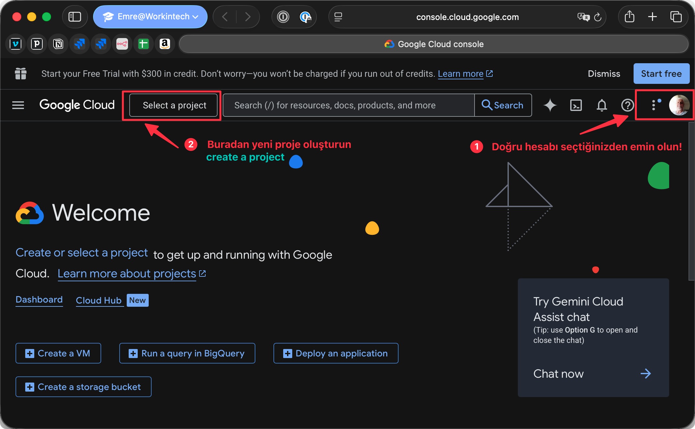

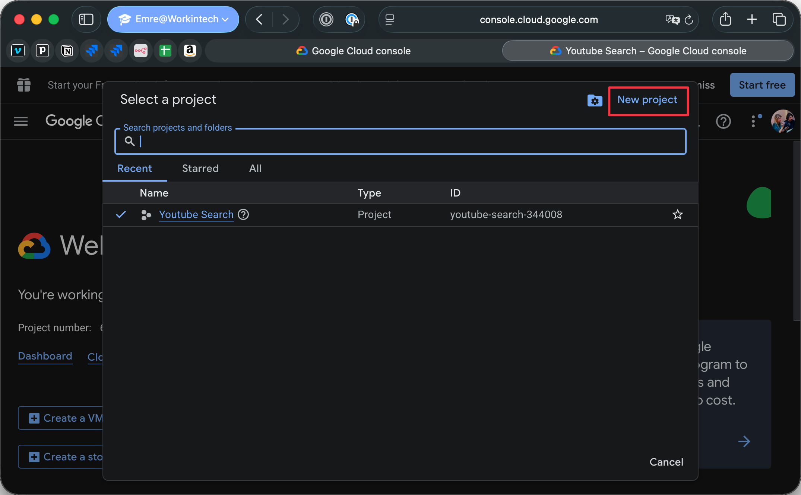

- Örneğin `science-s20` gibi bir isim verin
- ❗ ÖNEMLİ: *Location* alanının *No organization* olarak ayarlandığını kontrol edin ❗
- Proje için otomatik olarak oluşturulan `ID`’yi not edin, örneğin `science-s20-123456`


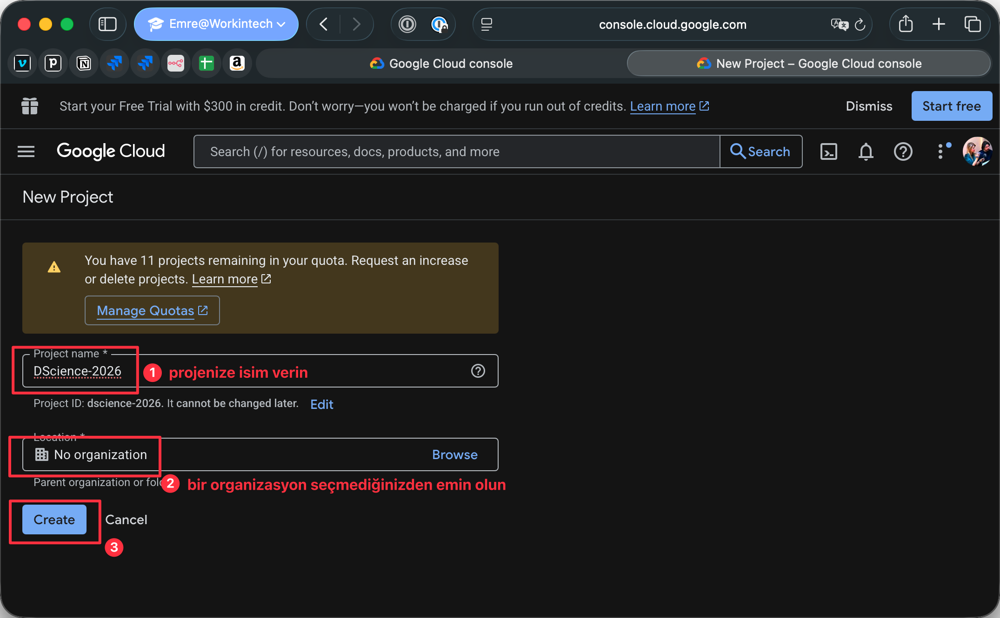


### Google Hesabı Dilini Ayarlama

Eğitim sırasında talimatları daha kolay takip edebilmek için GCP hesap ayarlarınızı açın:

https://myaccount.google.com/language

Eğer *preferred language* aşağıdakiler değil ise:
- **English**
- **United States**

İngilizce olarak değiştirin:
- Kalem simgesine tıklayın
- **English** seçin
- **United States** seçin
- **Select**'e tıklayın.

### Billing Account Ayarlama

Hesabınızı şimdi kredi kartınıza bağlayacaksın. Bu adım zorunludur; aksi takdirde GCP tarafından sunulan hizmetleri kullanamazsınız. Endişelenmeyin eğitim süresince çoğu GCP hizmetini ücretsiz kredi ile kullanabileceksin.

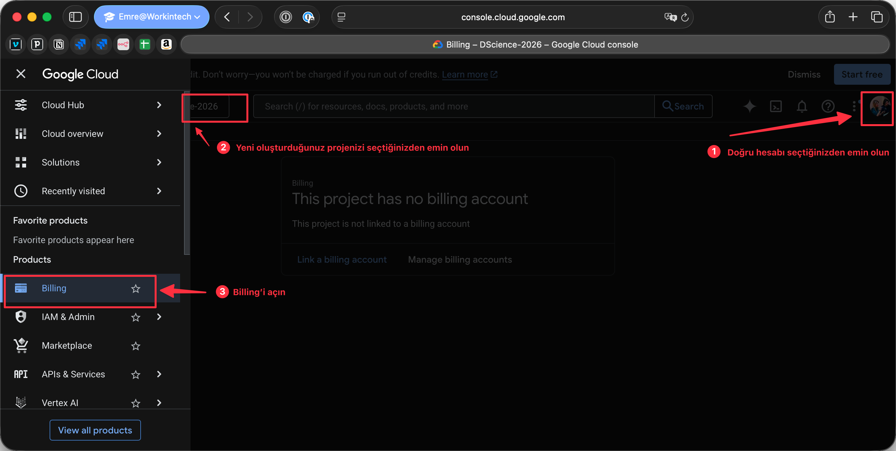

- **Billing**'e tıklayın
- **MANAGE BILLING ACCOUNTS**'a tıklayın
- **ADD BILLING ACCOUNT**'a tıklayın
- Billing hesabınıza bir isim verin, örn. `My Billing Account`
- "I have read..." kutusunu işaretleyin ve terms of service'i kabul edin
- **CONTINUE**'ya tıklayın
- Hesap türünüzü seçin: `Individual`
- Adınızı ve adresinizi girin

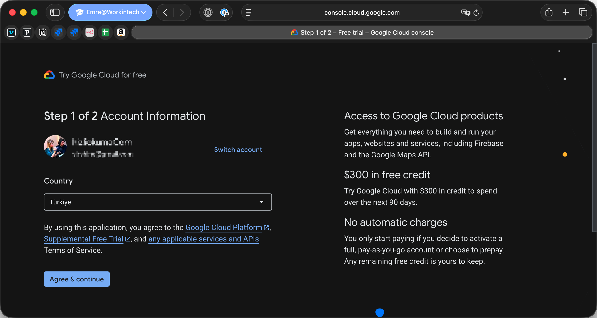
90 gün bayunca geçerli 300$ krediniz olduğunu görmelisiniz.

- Card details'a tıklayın
- Kredi kartı bilgilerinizi girin
- **START MY FREE TRIAL**'a tıklayın

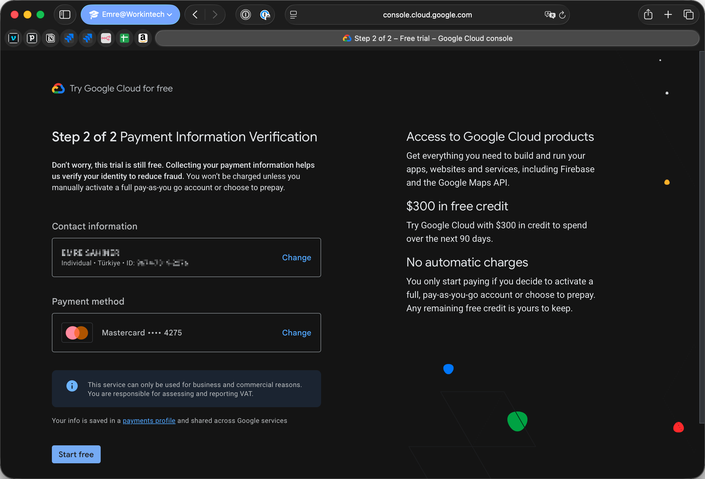

Bu işlem tamamlandığında, billing hesabınızın GCP projenize bağlı olduğunu doğrulayın.

- Projenizi seçin
- **Billing**'e gidin
- **LINK A BILLING ACCOUNT**'u seçin
- `My Billing Account`'u seçin
- **SET ACCOUNT**'a tıklayın

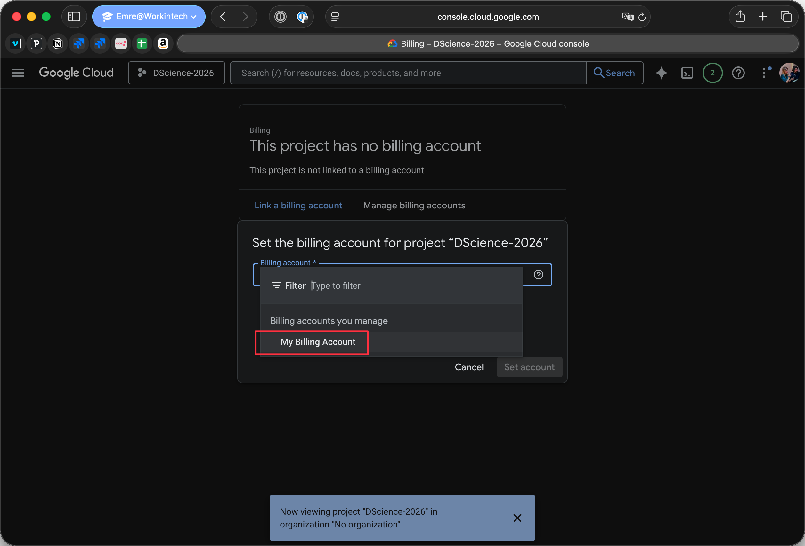

Aşağıdaki gibi bir yazı görmelisiniz:

```
Free trial status: $300 credit and 91 days remaining - with a full account, you'll get unlimited access to all of Google Cloud Platform.
```

<details>
  <summary>👉 Google'dan "Urgent: your billing account XXXXXX-XXXXXX-XXXXXX has been suspended" başlıklı bir email veya uyarı alrısanız. 👈</summary>

Bu özellikle sanal kart kullandı iseniz, bu karttan validation için para çekemedi ise veya aynı telefon numarası ile kayıt yaptırdıysanız olabiliyor.

- PROCEED TO VERIFICATION'a tıklayın
- Sanal kredi kartınızın ekran görüntüsünü gönderebilirsiniz (ekran görüntüsünden geçerlilik tarihini kaldırmayı unutmayın)
- Bir eğitime katıldığınızı, GCP'yi öğrenme amacıyla bir proje oluşturduğunuzu ve eğitim aşamasında beklenmedik bir fatura ile karşılaşmamak adına sanal kart kullanmak istediğinizi belirtin.

30 dakika içinde doğrulama veya ek bilgi talepleri alabilirsiniz veya sizden 500₺ gibi bir ödeme yapmanız istenebilir. Bu ödeme, hesabınızın doğrulanması içindir. Deneme süresi bitene kadar iade isteyebilirsiniz. Genelde 90 gün sonunda iade edilir ama buna güvenmeyin iade istiyorsanız kendiniz talep edin. Büyük ihtimalle o parayı google'da kullanmayı tarcih edeceksiniz 😉

Doğrulama tamamlandığında, "Your Google Cloud Platform billing account XXXXXX-XXXXXX-XXXXXX has been fully reinstated and is ready to use." başlıklı bir e-posta almanız gerekir.

</details>

### GCP service'lerini etkinleştirme

- Google Cloud projeniz için Billing(faturalama) hesabınının etkin olduğundan emin olun

ℹ️ Google Cloud kaynakları için kullanabileceğiniz **300$ kredi**'niz var; bu eğitim için fazlasıyla yeterli olacaktır.

- [BigQuery ve Compute Engine API'larını etkinleştirin](https://console.cloud.google.com/flows/enableapi?apiid=bigquery,compute) (Bu adım birkaç dakika sürebilir)

### Cloud sdk ayarları

- GCP için kullandığınız Google hesabıynızla `gcloud` CLI'da kimlik doğrulaması yapın:

```bash
gcloud auth login
```

- Web tarayıcınızda açılan yeni sekmede Google hesabınıza giriş yapın
- 👀 KONTROL: Etkin hesabınızı listeleyerek GCP için kullandığınız e-posta adresinin listede olduğunu doğrulayın
```bash
gcloud auth list
```

- Geçerli projenizi ayarlayın (`PROJECT_ID`'yi projenizin `ID`si ile değiştirin, örn. `science-s20-123456`)
```bash
gcloud config set project PROJECT_ID
```

- 👀 KONTROL: Etkin hesabınızı ve geçerli projenizi listeleyin ve projenizin listede olduğunu doğrulayın
```bash
gcloud config list
```

### Servis Account Key oluşturma 🔑

Artık bir `GCP account` ve bir `project` (PROJECT_ID ile tanımlanmış) oluşturduğunuza göre, kodunuzun hangi eylemleri (API çağrılarını) gerçekleştirmesine izin vereceğimizi yapılandıralım:

<details>
  <summary>🤔 Neden bir Servis Account Key'ine ihtiyacımız var?</summary>

  HATIRLATMA: Böyle bir key'i daha önce DBT için oluşturmuştuk.

  GCP hesabını kredi kartına bağladın. Hesabın, Google Cloud Platform kaynaklarını kullanımına göre faturalandırılacaktır. Ücretsiz deneme süresi bittikten sonra ya da deneme süresi içindeki harcama limitini aştığında fatura kesilecektir.

  Hesabında bir `GCP project` oluşturmuş bulunuyorsunuz; bu proje `PROJECT_ID` ile tanımlanır. `GCP project`'leri, GCP kaynaklarını tüketiminizi daha iyi organize edip izleyebilmenizi sağlar. Eğitim kapsamında tek bir proje oluşturacağız.

  Kodumuzun bir proje içindeki hangi kaynakları kullanabileceğini belirtmemiz gerekiyor. Kodumuz GCP kaynaklarına API çağrıları yoluyla erişecek.

  API çağrıları ücretsiz olmadığından, kodumuzun hangi API'leri nasıl kullanacağına dikkatle karar vermeliyiz. Eğitim süresince kısıtlama uygulamadan GCP API'lerini kullanmamıza izin vereceğiz.

  Bir GCP hesabına bağlı birden çok proje olabileceği gibi, bir proje de birden çok servise sahip olabilir (herhangi bir kod paketi veya servisi, GCP API çağrılarına ihtiyaç duyabilir).

  GCP, API çağrısı yapan servislerin platformda kayıtlı olmasını ve kimlik bilgilerinin bir `service account` aracılığıyla yapılandırılmasını istiyor.

  Şimdilik tek bir servis kullanacağız ve buna karşılık gelen `service account`'u oluşturacağız.
</details>

`service account` uygulamanızı (dolayısıyla GCP billing hesabınızı ve kredi kartınızı) tanımladığı için, bir sonraki adımlarda dikkatli olmalıyız!.

⚠️ **Servis hesabı json dosyanızı paylaşmayın 🔑** ⚠️ Dosyayı masaüstünde saklamayın, git deposuna koymayın (repo private olsa bile), veya sosyal medyada paylaşmayın. Ne derler bilirsiniz "Babanıza bile güvenmeyin" 😂.

#### Servis Accounts sayfasına gidin

Servis hesapları sayfasına şu bağlantı ile hızlıca açabilirsin: https://console.cloud.google.com/apis/credentials/serviceaccountkey

- İstendiğinde son projeler listesinden projenizi seçin.
- Eğer istenmiyorsa, sayfanın üstündeki proje seçicisinden doğru proje seçili olduğundan emin olun!.

Servis Accounts sayfasına alternatif olarak şu yoldan da ulaşabilirsin:

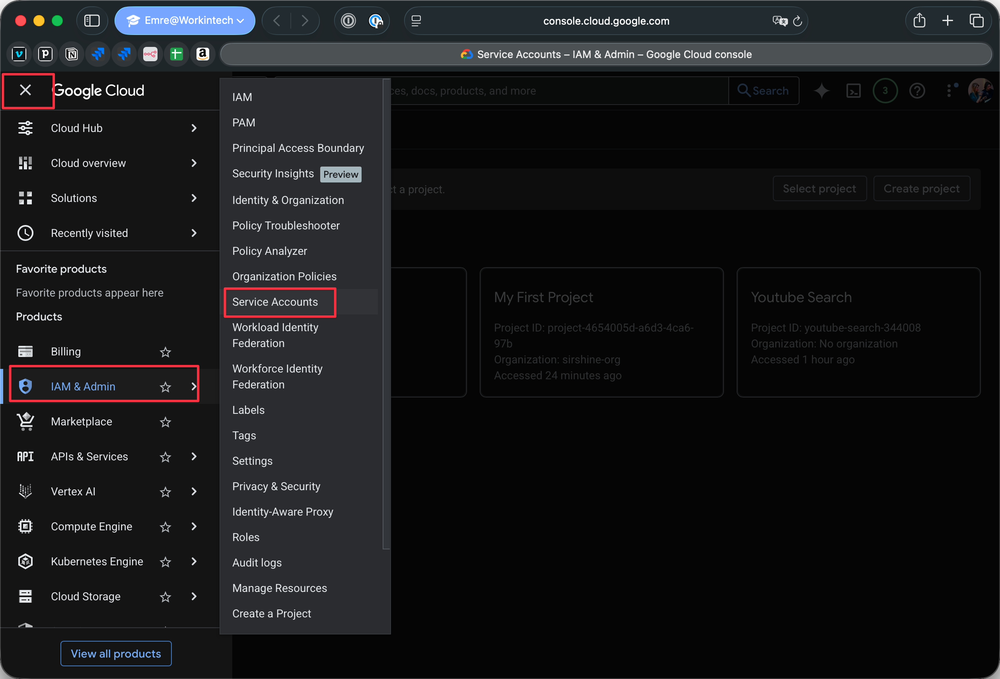


#### Servis Account oluşturma

- **CREATE SERVICE ACCOUNT**'a tıklayın.

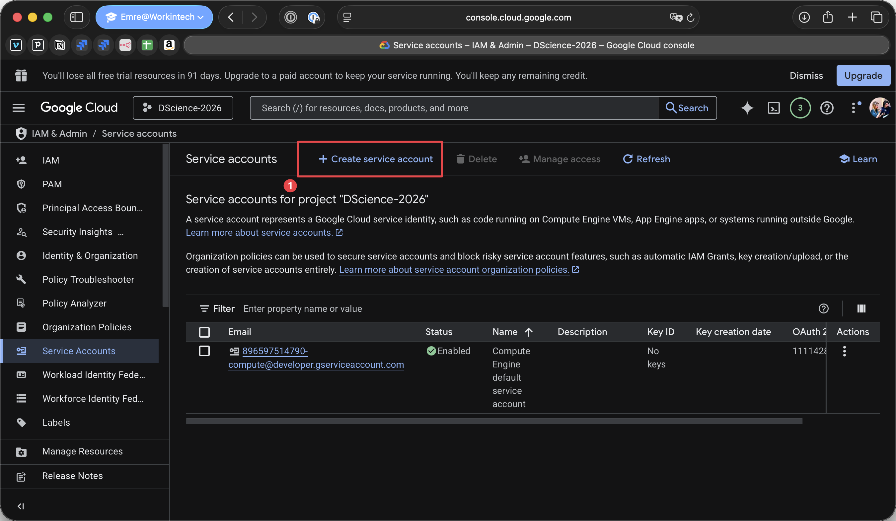


- Servis account'unuza bir isim, id ve açıklama verin, ardından **CREATE AND CONTINUE**'e tıklayın.


- **Select a role**'e tıklayın ve `Basic` altından **`Owner`** rolünü seçin; bu, servis account'unuzun proje kaynaklarına tam erişim izni verir.

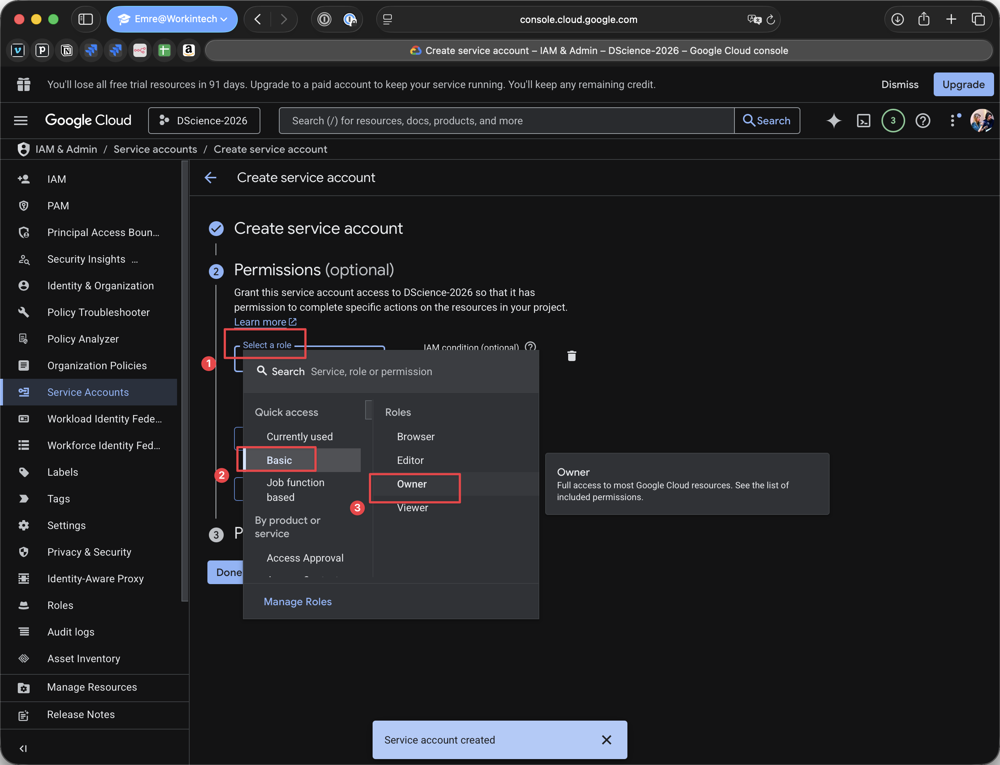


- Bu pencerenin altındaki mavi **DONE** butonuna tıklayın. *Grant your users access to this service account* bölümüne şimdilik gerek yok.

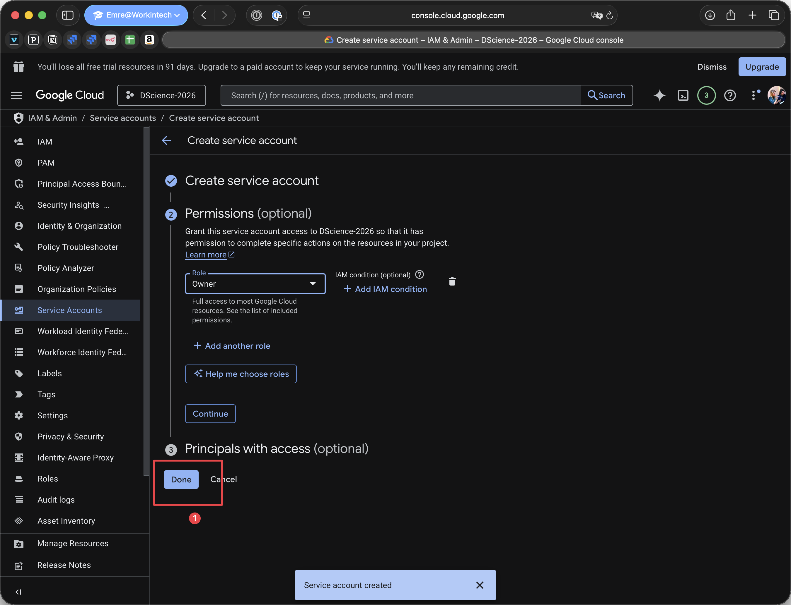


#### Bu servis account için JSON key'i oluşturma 🔑

- Servis accounts sayfasında, az önce oluşturduğun servis account'unun e-posta adresine tıklayın.

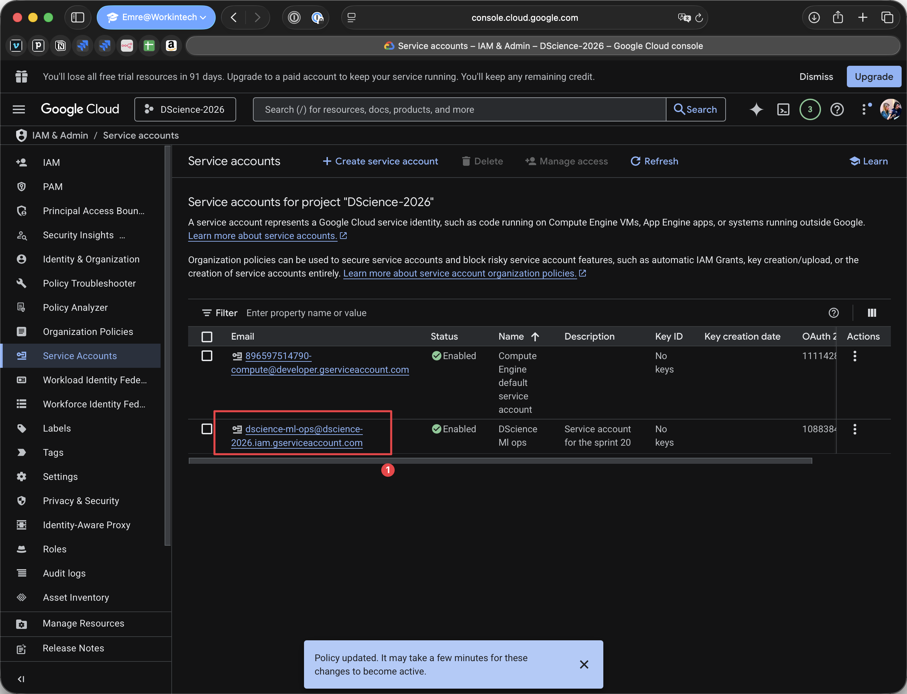


- Sayfanın üst kısmındaki **KEYS** sekmesine tıklayın.

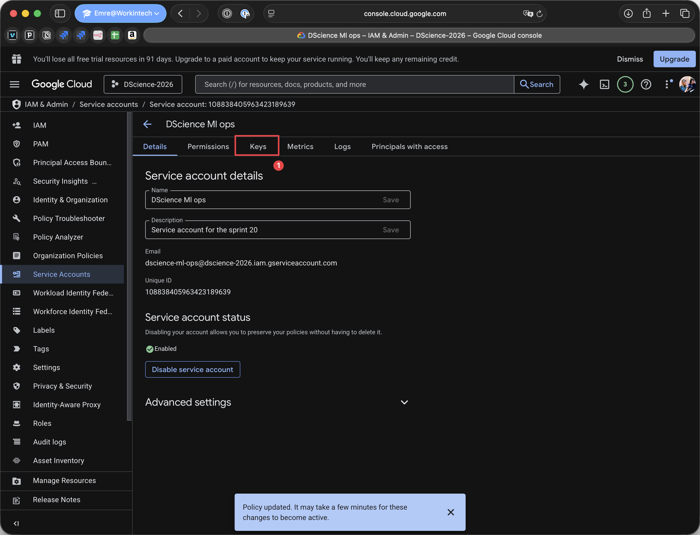


- **ADD KEY**'e tıklayın, ardından **Create new key**'i seçin.

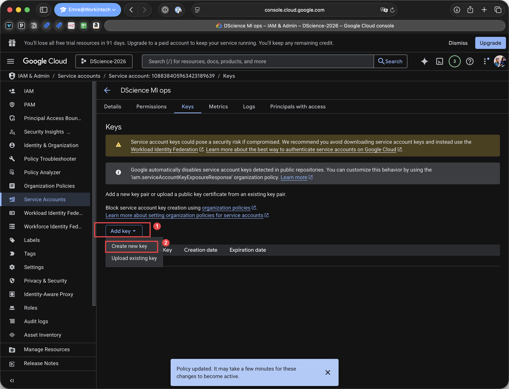


- **JSON**'i seçin ve **CREATE**'e tıklayın.

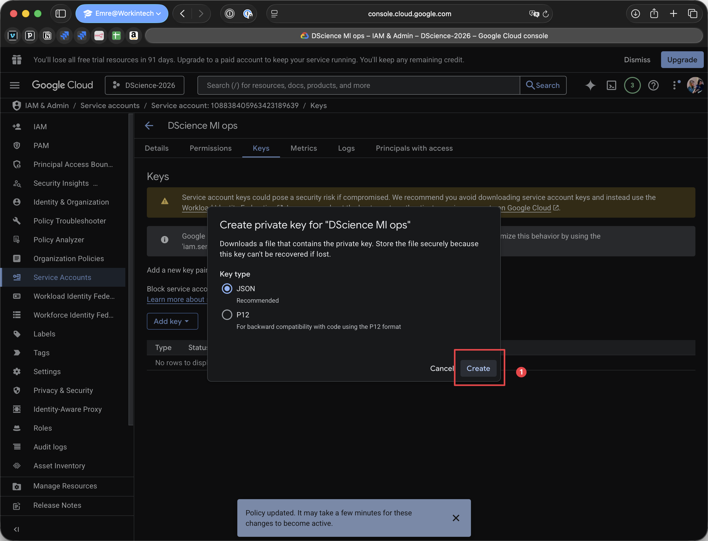


- Tarayıcı, oluşturduğunuz json dosyasını indirme klasörünüze kaydedecektir (dosya ismi servis accountunuzun adına göre oluşur, ör. `science-s20-123456789abc.json`).
Artık servis account json dosyasını Windows diskinden Ubuntu diskine taşıyacağız. Bu, Ubuntu'daki geliştirme araçlarının GCP hesabınızın kaynaklarına erişmesini sağlayacak.

Önce dosyayı saklayacağımız bir dizin oluşturalım.

👉 Bir Ubuntu terminali açın ve aşağıdaki komutları çalıştırın

🚨 `GITHUB_NICKNAME` yerine **GitHub** kullanıcı adınızı yazın

``` bash
cd ~/code/GITHUB_NICKNAME
ls -la
```

Komut doğru dizini göstermiyorsa veya hata veriyorsa büyük ithimalle eğitim başında söylediğimiz mantıkta bir klasör'de projelerinizi oluşturmadınız. Projelerinizi koyduğunuz dizine geçebilirsiniz. Sorun yaşıyorsanız, Slack'ten #data-yardım kanalından yardım isteyin. 🙏

Sorun yoksa kuruluma devam edebilirsin:

``` bash
mkdir gcp
```


Şimdi servis account json dosyasını az önce oluşturduğumuz `gcp` dizinine taşıyacağız.

Windows **File Explorer**'ı (Win + E) açın ve Ubuntu dosya sistemindeki `gcp` dizinini bulun.

Adres çubuğuna Ubuntu dosya sistemindeki `gcp` dizininin konumunu elle yazabilirsin:

🚨 Aşağıdaki komutta şu değerleri değiştirin:
- `UBUNTU_USERNAME` yerine **Ubuntu** kurulumu sırasında seçtiğiniz kullanıcı adını yazın
- `GITHUB_NICKNAME` yerine **GitHub** kullanıcı adınızı yazın

```
\\wsl$\Ubuntu\home\UBUNTU_USERNAME\code\GITHUB_NICKNAME
```


Windows **File Explorer**'da `gcp` dizinini bulduktan sonra indirdiğiniz servis account json dosyasını buraya taşıyın.

Dosya artık Ubuntu dosya sisteminden görülebilir olmalıdır.

👉 Bir Ubuntu terminali açın ve servis account json dosyasının taşındığını doğrulayın

``` bash
cd gcp
ls -la
```

Eğer `gcp` dizininde servis account json dosyasını görmüyorsanız, Slack'ten #data-yardım kanalından yardım isteyin.🙏

Şimdi servis account json dosyanızın yolunu bir ortam değişkeninde saklayacağız.

🚨 Aşağıdaki komutta şu değerleri değiştirin:
- `UBUNTU_USERNAME`'yi **Ubuntu** kurulumu sırasında seçtiğiniz kullanıcı adı ile değiştirin
- `GITHUB_NICKNAME`'yi **GitHub** kullanıcı adınız ile değiştirin
- `SERVICE_ACCOUNT_JSON_KEY_DOSYASI.json`'u servis hesap json dosyanızın adıyla değiştirin


``` bash
echo 'export GOOGLE_APPLICATION_CREDENTIALS=/home/UBUNTU_USERNAME/code/GITHUB_NICKNAME/gcp/SERVICE_ACCOUNT_JSON_KEY_DOSYASI.json' >> ~/.zshrc
```

**Not:** Bu komutu her çalıştırdığınızda, aynı satır `~/.zshrc` dosyanıza ayrı ayrı eklenecektir. Hata yaptıysanız dosyayı açıp satırı düzenlemeniz/silmeniz en iyisidir.

Bunu yapmak için şu komutu kullanabilirsin:

```bash
code ~/.zshrc
```

Terminal'de tabii ki! 😄


<details>
  <summary>ℹ️ Bir dosyanın mutlak yolunu nasıl bulurum?</summary>

  Dosyayı terminale sürükleyip bırakarak bulabilirsin 😉.

</details>

**Terminalinizi quit edin ve tekrar başlatın** ve şu komutu çalıştırın:

``` bash
echo $GOOGLE_APPLICATION_CREDENTIALS
```

Çıktı şu şekilde olmalıdır:

```bash
/some/absolute/path/to/your/gcp/SERVICE_ACCOUNT_JSON_KEY_DOSYASI.json
```

Şimdi servis account json dosyanızın yolunun doğru olduğunu doğrulayalım:

``` bash
cat $(echo $GOOGLE_APPLICATION_CREDENTIALS)
```

👉 Bu komut servis account json dosyanızın içeriğini göstermelidir. Göstermezse Slack'ten #data-yardım kanalından yardım isteyin. 🙏

Kodunuz ve araçlarınız artık GCP hesabınızdaki kaynaklara erişebilecek.

Son yapılandırma adımlarına geçelim...

- Aktif hesabınıza ve geçerli projenize ait servis hesaplarını listeleyin
```bash
gcloud iam service-accounts list
```

- Servis hesabı e-posta adresini alın, ör. `SERVICE_ACCOUNT_NAME@PROJECT_ID.iam.gserviceaccount.com`
- CLI'dan servis hesabının rollerini listeleyin (PROJECT_ID ve SERVICE_ACCOUNT_EMAIL ile değiştirin)
```bash
gcloud projects get-iam-policy PROJECT_ID \
--flatten="bindings[].members" \
--format='table(bindings.role)' \
--filter="bindings.members:SERVICE_ACCOUNT_EMAIL"
```
- Servis hesabınızın `roles/owner` rolüne sahip olduğunu görmelisiniz

<details>
  <summary>Sorun giderme</summary>

- `AccessDeniedException: 403 The project to be billed is associated with an absent billing account.`
  - GCP projeniz için billing'in etkin olduğundan emin olun: https://cloud.google.com/billing/docs/how-to/modify-project
</details>

🏁 GCP kurulumu tamamlandı. Şimdi onlar düşünsün!
